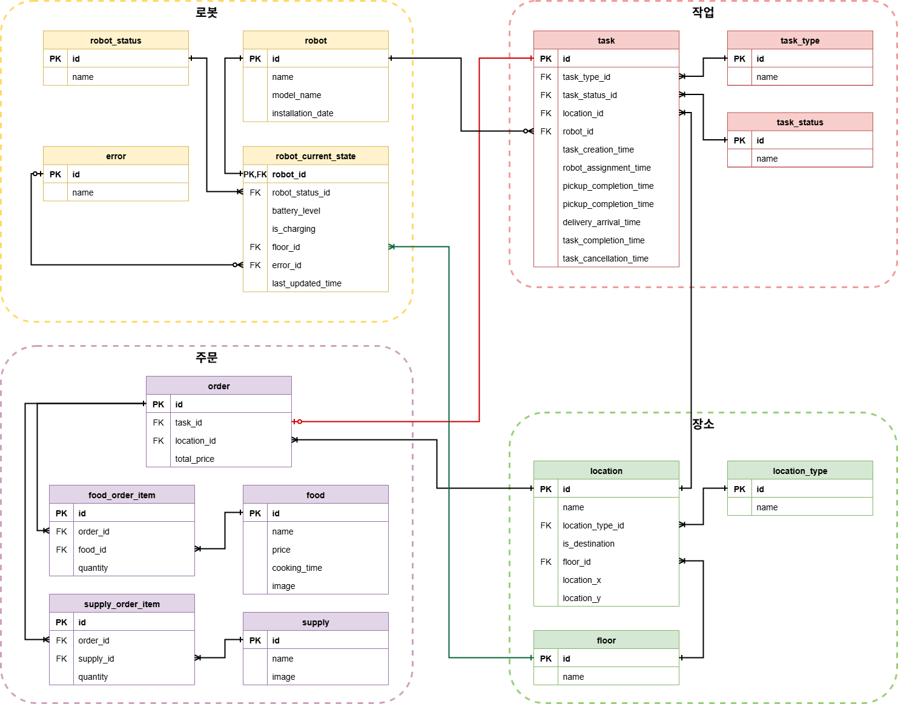
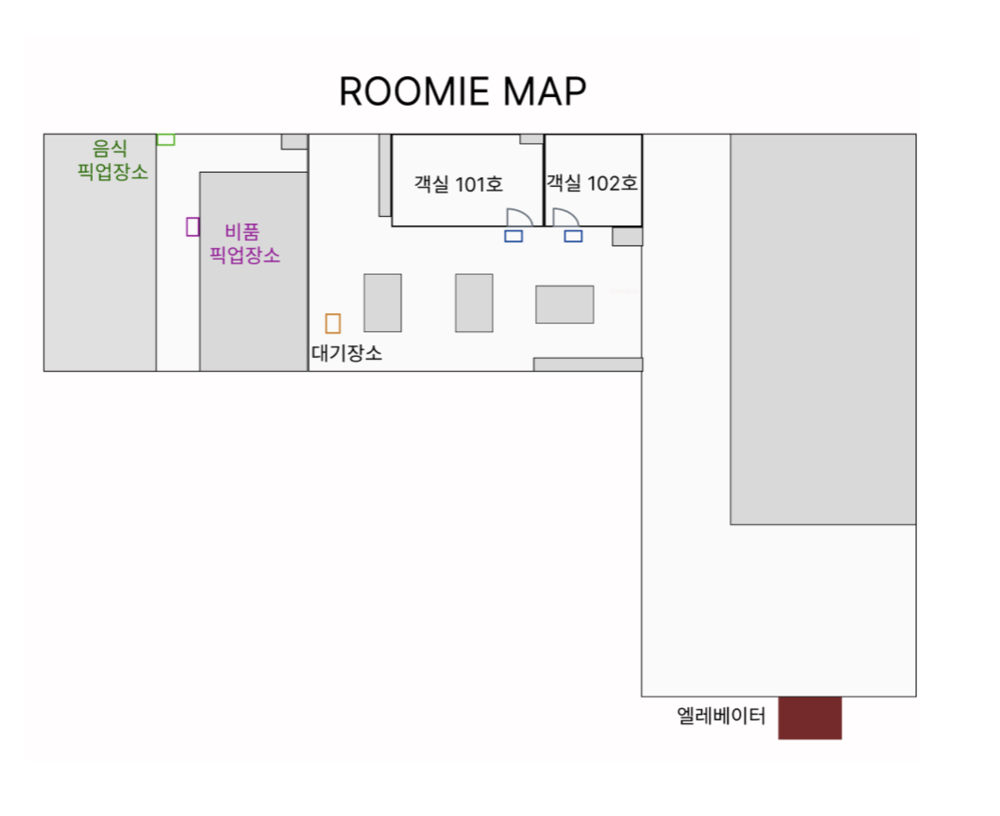
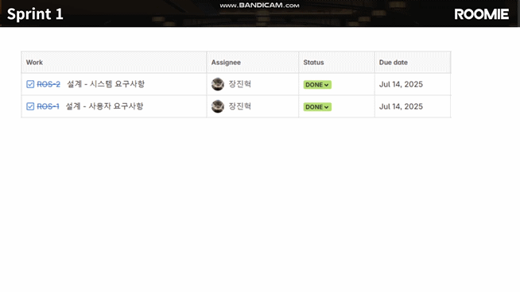
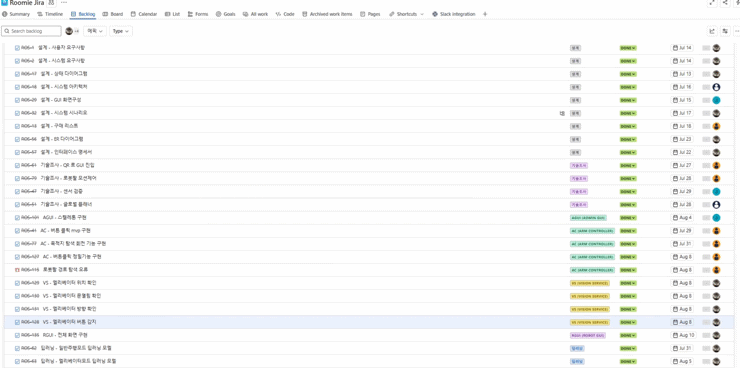
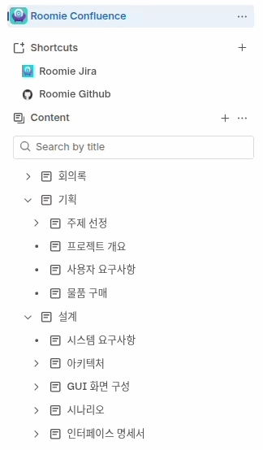

<p align="center">
  <a href="https://www.apache.org/licenses/LICENSE-2.0">
    
  </a>
  <a href="https://docs.google.com/presentation/d/1ov9HC-qspBt8EVuyY66NAY0iMZ1nOyS5X9acsZ7iivs/edit?usp=sharing">
    
  </a>
  <a href="https://www.youtube.com/playlist?list=PLeVDEKHes6sHO5c1vp_Hu00HwNrdS69pk">
    
  </a>
</p>

# 📚 목차

- [1. 프로젝트 개요](#1-프로젝트-개요)
- [2. 주요 기능](#2-주요-기능)
- [3. 핵심 기술](#3-핵심-기술)  
- [4. 기술적 문제 및 해결](#4-기술적-문제-및-해결)
- [5. 시스템 설계](#5-시스템-설계)
- [6. 프로젝트 구조](#6-프로젝트-구조)
- [7. 기술 스택](#7-기술-스택)
- [8. 일정 관리](#8-프로젝트-일정-관리)
- [9. 팀 구성](#9-팀-구성)
- [10. 라이선스](#10-라이선스)

---

# 1. 프로젝트 개요

<div align="center">
  <table>
    <tr>
      <td align="center">
        <br>
        <sub>룸서비스 배송 기능</sub>
      </td>
      <td align="center">
        <br>
        <sub>길안내 기능</sub>
      </td>
      <td align="center">
        <br>
        <sub>층간 이동 기능</sub>
      </td>
      <td align="center">
        <br>
        <sub>관리자 모니터링 기능</sub>
      </td>
    </tr>
  </table>
</div>


- **프로젝트 목적**
  - 호텔에서 발생하는 반복적인 업무를 로봇이 자율적으로 수행하여 직원의 업무 부담을 줄이고 투숙객에게는 새롭고 편리한 경험을 제공
  
- **프로젝트 기간**
  - 2025년 7월 7일 ~ 2025년 8월 13일(총 38일)
---

# 2. 주요 기능

## 🍽️ 룸서비스 배송 기능

<div align="center">
  <table>
    <tr>
      <th style="width:15%">주요 단계</th>
      <th style="width:80%">설명</th>
      <th style="width:30%">사진</th>
    </tr>
    <tr>
      <td>음식 주문 및 요청</td>
      <td>
        ▪ 객실 내 비치된 QR코드로 Guest GUI 접속<br>
        ▪ 메뉴 확인 후 주문 → Staff GUI로 알림 전송<br>
        ▪ 조리 완료 후 Staff GUI에서 “픽업 요청” 전달
      </td>
      <td>
        <p align="center">
          
          
        </p>
      </td>
    </tr>
    <tr>
      <td>픽업 및 적재</td>
      <td>
        ▪ Roomie가 레스토랑 픽업 위치로 이동<br>
        ▪ ArUco Marker 인식으로 정확한 픽업 위치 정렬<br>
        ▪ Robot GUI에 주문 내역 표시 → 적재 혼동 방지<br>
        ▪ 서랍 제어 (문 열림/잠금 센서, 적재 여부 감지 센서 포함)
      </td>
      <td>
        <p align="center">
          <br>
          <br>
          
        </p>
      </td>
    </tr>
    <tr>
      <td>객실 배송</td>
      <td>
        ▪ Nav2 기반 주행으로 객실 앞까지 이동<br>
        ▪ 목적지 ArUco Marker 인식 → 객실 위치 확인<br>
        ▪ Guest GUI 및 Robot GUI를 통해 도착 알림 제공
      </td>
      <td>
        <p align="center">
          
        </p>
      </td>
    </tr>
    <tr>
      <td>음식 수령</td>
      <td>
        ▪ 고객이 Robot GUI 조작 → 서랍 해제 후 음식 수령<br>
        ▪ 완료 후 로봇은 대기 장소로 복귀
      </td>
      <td>
        <p align="center">
          
        </p>
      </td>
    </tr>
  </table>
</div>


---

## 🧭 길 안내 기능

<div align="center">
  <table>
    <tr>
      <th style="width:15%">주요 단계</th>
      <th style="width:80%">설명</th>
      <th style="width:30%">사진</th>
    </tr>
    <tr>
      <td>안내 요청 및 목적지 입력</td>
      <td>
        ▪ 객실 카드 인증 시 목적지 자동 입력<br>
        ▪ Guest GUI 또는 Robot GUI에서 직접 입력 가능
      </td>
      <td>
        <p align="center">
          
        </p>
      </td>
    </tr>
    <tr>
      <td>안내 대상 인식</td>
      <td>
        ▪ 로봇 후면 카메라로 고객 인식<br>
        ▪ DeepSORT 기반 타겟 추적 알고리즘 적용
      </td>
      <td>
        <p align="center">
          
        </p>
      </td>
    </tr>
    <tr>
      <td>목적지 안내</td>
      <td>
        ▪ 고객을 일정 거리로 추적하며 목적지까지 안내<br>
        ▪ 고객이 시야에서 벗어나면 정지<br>
        ▪ 고객이 다시 나타나면 이동 재개
      </td>
      <td>
        <p align="center">
          
        </p>
      </td>
    </tr>
  </table>
</div>


---

## 🏢 층간 이동 기능

<div align="center">
  <table>
    <tr>
      <th style="width:15%">주요 단계</th>
      <th style="width:80%">설명</th>
      <th style="width:30%">사진</th>
    </tr>
    <tr>
      <td>엘리베이터 호출</td>
      <td>
        ▪ Vision Service가 버튼 좌표 인식<br>
        ▪ Arm Controller를 이용해 호출 버튼 클릭
      </td>
      <td>
        <p align="center">
          <br>
          <br>
          
        </p>
      </td>
    </tr>
    <tr>
      <td>탑승 및 내부 조작</td>
      <td>
        ▪ 문 중앙 정렬 후 탑승<br>
        ▪ 층수 버튼 크기와 좌표를 기반으로 Arm Controller 제어<br>
        ▪ 상단 디스플레이 OCR로 목적 층 도착 여부 확인
      </td>
      <td>
        <p align="center">
          <br>
          <br>
          
        </p>
      </td>
    </tr>
    <tr>
      <td>하차</td>
      <td>
        ▪ 목적 층 도착 후 중앙 정렬 → 안전하게 하차
      </td>
      <td>
        <p align="center">
          
        </p>
      </td>
    </tr>
  </table>
</div>

---

## 📊 관리자 모니터링 기능

<div align="center">
  <table>
    <tr>
      <th style="width:15%">주요 단계</th>
      <th style="width:80%">설명</th>
      <th style="width:30%">사진</th>
    </tr>
    <tr>
      <td>대시보드</td>
      <td>
        ▪ 현재 작업 수, 로봇 수를 실시간 확인<br>
        ▪ 2D 맵 상의 로봇 위치 표시
      </td>
      <td>
        <p align="center">
          
        </p>
      </td>
    </tr>
    <tr>
      <td>로봇 관리</td>
      <td>
        ▪ 현재 위치, 현재 작업, 배터리 상태 모니터링
      </td>
      <td>
        <p align="center">
          
        </p>
      </td>
    </tr>
    <tr>
      <td>작업 히스토리</td>
      <td>
        ▪ 작업 리스트 및 상세 기록 확인 가능
      </td>
      <td>
        <p align="center">
          
        </p>
      </td>
    </tr>
  </table>
</div>

 `

---

# 3. 핵심 기술

## 1) 로봇암 제어

<div align="center">
  <table>
    <tr>
      <td align="center">
        <br>
        <sub>로봇암 제어 원리</sub>
      </td>
      <td align="center">
        <br>
        <sub>로봇암을 이용한 버튼 클릭</sub>
      </td>
    </tr>
  </table>
</div>

<p align="center">
  <a href="ros2_ws/src/roomie_ac/README.md">상세 설계 보기</a>
</p>

- **구성**
  - 서보모터
  - 2D 카메라
  - 버튼 클릭 엔드이펙터
- **버튼 인식**
  - 베이스 좌표 → 팔끝 좌표 → 카메라 좌표 → 버튼 좌표 계산
- **동작 방식**
  - 관측 자세 → 클릭 준비 자세 → 버튼 클릭 → 클릭 확인
- **제어 기법**
  - Gaussian 속도/가속도 프로파일 적용 → 미세 진동(지터) 최소화

---

## 2) 경로 생성 및 주행

<div align="center">
  <table>
    <tr>
      <td align="center">
        <br>
        <sub>경로 생성</sub>
      </td>
      <td align="center">
        <br>
        <sub>정적 장애물 회피</sub>
      </td>
      <td align="center">
        <br>
        <sub>동적 장애물 회피</sub>
      </td>
    </tr>
  </table>
</div>

- **Nav2 기반 경로 계획**
  - 전역/지역 경로 생성 및 주행
- **웨이포인트 기반 경로 생성**
  - Depth 카메라로 장애물을 웨이포인트와 매칭
  - 최적 경로 계산에 **A\*** 알고리즘 적용
- **동적 장애물 처리**
  - 실시간 Depth 카메라 감지
  - 임계 거리 이내 접근 시 정지 → 사라지면 재개
- **RTR 주행 (Rotate–Translate–Rotate)**
  - 엘리베이터 탑승/하차 시 정밀 정렬 + 후진 동작 지원

---

## 3) 비전 인식

<div align="center">
  <table>
    <tr>
      <td align="center">
        <br>
        <sub>장애물 회피를 위한 주행중 장애물 인식</sub>
      </td>
      <td align="center">
        <br>
        <sub>엘리베이터 외부 객체 인식</sub>
      </td>
      <td align="center">
        <br>
        <sub>길안내 기능을 위한 DeepSORT 특정인 추적</sub>
      </td>
    </tr>
  </table>
</div>


- **YOLOv8n 기반 객체 인식**
  - 장애물: 정적/동적/유리문
  - 엘리베이터: 버튼, 층수 표시기, 문, 방향등
- **성능 보완**
  - CNN으로 세부 버튼 분류
  - EasyOCR로 층수 인식
- **사람 타겟 추적**
  - YOLOv8n으로 사람 검출
  - DeepSORT로 특정 인물 추적 및 좌표 발행
 
---

## 4) 마이크로 ROS

<div align="center">
  <table>
    <tr>
      <td align="center">
        <br>
        <sub>적재 여부 및 문 닫힘 확인을 위한 초음파 센서</sub>
      </td>
      <td align="center">
        <br>
        <sub>마이크로 ROS를 이용한 서랍 문 제어</sub>
      </td>
    </tr>
  </table>
</div>


- **적재함 문 감지**
  - 센서와 문 사이의 거리 측정
  - 측정거리 5.0cm 초과 시 문이 열린 것으로 판단
- **적재 감지**
  - 내부 공간 측면 하단에 설치되어 반대쪽 측면까지의 거리 측정
  - 측정거리 25.0cm 미만 시 물건이 적재된 것으로 판단
- **RFID 카드 리더**
  - MFRC522 모듈을 사용하여 RFID 카드의 UID를 읽음
  - 카드 데이터: 카드의 블록 4에 저장된 4바이트 데이터를 location_id로 해석
  - 카드 읽기 성공 시 `success=true`, `location_id=읽은값`, 실패 시 `success=false`, `location_id=-1`
- **LED 상태 표시**
  - 로봇의 상태(RobotState)에 따라 RGB LED 색상 제어
 
<br>

  | 상태 ID | 상태 이름 | RGB LED |
  |---|---|---|
  | 0                    | `INITIAL` | 청록색 |
  | 1, 2, 11, 13, 21, 23 | `CHARGING`, `WAITING`, `PICKUP_WAITING`, `DELIVERY_WAITING`, `GUIDE_WAITING`, `DESTINATION_SEARCHING` | 초록색 |
  | 10, 12, 20, 22, 30, 31 | `PICKUP_MOVING`, `DELIVERY_MOVING`, `CALL_MOVING`, `GUIDE_MOVING`, `RETURN_MOVING`, `ELEVATOR_RIDING` | 파란색 |
  | 90 | `ERROR` | 빨간색 |

---

# 4. 기술적 문제 및 해결

### 🤖 로봇암 떨림 현상
- **문제**: 일반 등속 제어 시 팔끝이 미세하게 떨림  
- **해결**: Gaussian 함수 기반 속도/가속도 제어로 진동 최소화  

### 🛣️ 실내 복잡 환경 경로 생성
- **문제**: 통로가 좁거나 장애물 있을 때 우회 불가  
- **해결**: 웨이포인트 기반 경로 설계 + A\* 알고리즘으로 사전 우회 처리  

### 🧠 YOLO 단일 모델 한계
- **문제**: 객체 클래스 수 증가 → 성능 저하  
- **해결**: YOLOv8n은 ROI 생성, CNN으로 버튼 분류, EasyOCR로 층수 인식  

### 🏢 엘리베이터 탑승 정밀 동작
- **문제**: 버튼 클릭 및 내부 정렬 시 기존 Nav2 주행의 한계  
- **해결**: RTR(Rotate–Translate–Rotate) 패턴 적용 → 정밀 정렬 및 후진 동작 가능  

---

# 5. 시스템 설계

## 1) System Requirements

```
[Priority 범례]
- `R` : 필수 구현 (Required) 
- `O` : 선택 구현 (Optional)  
```


| SR_ID    | SR_NAME              | Description | Priority |
|----------|----------------------|-------------|----------|
| SR_01    | 로봇 호출 기능 | 특정 위치로 로봇 호출<br>호출 가능 장소:<br>- 객실 입구 (ROOM_XX)<br>- 레스토랑 (RES_2)<br>- 로비 (LOB_2) | R |
| SR_02    | 로봇 이동 기능 | 로봇이 자율 주행을 통해 작업 수행 또는 복귀 이동<br>작업 종류:<br>- 호출<br>- 길 안내<br>- 배송<br>- 식음료<br>- 비품 | R |
| ├─ SR_02_01 | 경로 생성 기능 | 목적지까지 로봇 스스로 경로를 생성하고 이동 | R |
| ├─ SR_02_02 | 장애물 회피 기능 | 이동 중 장애물 인식 및 충돌 회피<br>장애물:<br>- 정적: 식탁, 의자, 휴지통<br>- 동적: 사람 | R |
| ├─ SR_02_03 | 충돌 감지 기능 | 주행 중 충돌 감지하여 일시 정지<br>IMU 값 기반 충돌 판단 (Threshold 하드웨어 측정) | R |
| ├─ SR_02_04 | 전복 감지 기능 | 주행 불능 시 전복 감지 및 관리자 알림<br>IMU 값 기반 전복 판단 (Threshold 하드웨어 측정) | O |
| └─ SR_02_05 | 팔로잉 확인 기능 | ‘길 안내’ 수행 시 투숙객이 따라오고 있는지 확인 | R |
| SR_03    | 층간 이동 기능 | 엘리베이터 호출 및 버튼 조작을 통해 층간 이동 | R |
| ├─ SR_03_01 | 엘리베이터 호출 기능 | 로봇이 엘리베이터를 현재 층으로 호출<br>방법:<br>- API 호출<br>- 로봇팔 물리 조작 | R |
| ├─ SR_03_02 | 엘리베이터 목적 층 선택 기능 | 탑승 후 목적 층 선택<br>방법:<br>- API 호출<br>- 로봇팔 물리 조작 | R |
| ├─ SR_03_03 | 엘리베이터 탑승 기능 | 현재 층 도착 시 로봇 탑승<br>판단 요소:<br>- 엘리베이터 방향<br>- 위치<br>- 문 열림/닫힘 | R |
| └─ SR_03_04 | 엘리베이터 하차 기능 | 목적 층 도착 시 로봇 하차<br>판단 요소:<br>- 위치<br>- 문 열림/닫힘 | R |
| SR_04    | 작업 수행 중 알림 기능 | 작업 중 투숙객에게 알림 제공<br>호출, 길 안내, 배송 각각 상태 알림<br>작업 실패/시스템 오류 시 사유 포함 | R |
| SR_05    | 맞춤 응대 기능 | 작업 시작/종료 시 사용 언어에 따른 음성 응대<br>상황:<br>- 길 안내 시작<br>- 호출 도착<br>- 길 안내 종료<br>- 배송 수령 | R |
| SR_06    | 길 안내 요청 기능 | 투숙객 카드키 인식 후 목적지 안내 요청<br>가능 장소:<br>- 객실 입구<br>- 레스토랑<br>- 로비 | R |
| ├─ SR_06_01 | 투숙객 외형 인식 기능 | 투숙객 추적을 위한 외형 인식 (카메라 활용) | O |
| └─ SR_06_02 | 목적지 입력 기능 | 목적지 선택 옵션:<br>- 객실: 카드키 자동 입력 / 직접 입력 / 음성 / 디스플레이 조작<br>- 객실 외: 레스토랑 / 로비 | O |
| SR_07    | 배송 요청 기능 | 객실 내 물품 배송 요청<br>배송 유형:<br>- 식료품(스파게티, 피자)<br>- 비품(칫솔, 타월, 생수, 수저) | O |
| SR_08    | 배송 물품 적재 기능 | 픽업 장소에서 직원이 물품 적재<br>적재 가능 수량: 최대 2개 객실 | O |
| └─ SR_08_01 | 배송 물품 확인 기능 | 적재 물품 확인<br>절차:<br>- IR 센서 1차 감지 → 직원 ‘적재 확인’ → 출발 카운트다운 | R |
| SR_09    | 배송 상태 확인 기능 | 투숙객에게 배송 상태 실시간 제공<br>상태:<br>- 진행 단계<br>- 현재 위치<br>- 예상 도착 시간 | O |
| SR_10    | 작업 정보 관리 기능 | 작업 종류/진행 상태 관리<br>- 호출, 길 안내, 배송<br>진행 상태 추적 | R |
| ├─ SR_10_01 | 작업 이력 조회 기능 | 관리자 전체 작업 이력 조회<br>조회 항목: ID, 종류, 진행 상태 | R |
| ├─ SR_10_02 | 작업 정보 모니터링 기능 | 직원에게 작업 정보 실시간 제공 | R |
| ├─ SR_10_03 | 작업 순서 변경 기능 | 대기 작업 순서 수동 변경 | R |
| └─ SR_10_04 | 작업 자동 배정 기능 | 대기 로봇에 작업 자동 배정 | O |
| SR_11    | 자동 복귀 기능 | 작업 종료 후 대기 장소(로비) 자동 복귀<br>조건: 작업 완료/취소 시 복귀, 충전 필요 시 충전 스테이션으로 이동 | O |
| SR_12    | 로봇 정보 관리 기능 | 로봇 ID, 모델명, 생산일자 관리 | R |
| └─ SR_12_01 | 로봇 정보 조회 기능 | 관리자 필터링/검색으로 로봇 리스트 조회 | R |
| SR_13    | 로봇 상태 관리 기능 | 로봇 상태 항목 관리:<br>- 위치, 배터리, 충전 여부, 작업 ID, 오류 상태 | R |
| ├─ SR_13_01 | 로봇 상태 모니터링 기능 | 관리자에게 로봇 상태 실시간 제공 | R |
| ├─ SR_13_02 | 충돌 알림 기능 | 충돌 감지 시 관리자 알림 제공 (SR_02_03 연계) | R |
| └─ SR_13_03 | 로봇 상태 조회 기능 | 충전/충돌 이력 조회<br>- 충전 ID, 시간<br>- 충돌 장소, 시간 | R |
| SR_14    | 자동 충전 기능 | 대기장소에서 배터리 상태에 따라 자동 충전<br>도킹 스테이션 기반 충전 | R |
| └─ SR_14_01 | 저전력 자동 복귀 기능 | 배터리 20% 이하일 경우 작업 종료 후 대기 장소 복귀 | R |

---

### 2) System Architecture Diagram

<p align="center">
  
</p>

- 로봇, GUI, 서버 등 전체 시스템 구성 요소와 통신 흐름을 한눈에 보여주는 아키텍처 다이어그램

---

### 3) State Diagram

<p align="center">
  
</p>

- 로봇의 전체 동작을 상태 전이로 설계하여 상태 다이어그램으로 표현

---

### 4) ERD(Entity Relationship Diagram)

<p align="center">
  
</p>

- 시스템에서 사용하는 데이터베이스 테이블 구조와 관계를 나타낸 ERD 다이어그램

---

### 5) Test MAP

<p align="center">
  
</p>

- 로봇 주행 및 기능 테스트를 수행하기 위해 제작된 실내 테스트 맵

---


# 6. 프로젝트 구조

```
Roomie/
├── ros2_ws/                            # ROS2 공통 워크스페이스
│   ├── build/                          # colcon build 시 자동 생성
│   ├── install/
│   ├── log/
│   └── src/
│       ├── micro_ros_setup/           # micro-ros 빌드 도구
│       ├── roomie_msgs/               # 공용 메시지 (msg/srv/action 정의)
│       ├── roomie_rc/                 # 로봇 제어 노드 (RC)
│       ├── roomie_rgui/               # 로봇 GUI 노드 (RGUI)
│       ├── roomie_vs/                 # Vision Service 노드 (VS)
│       ├── roomie_rms/                # Main Server 노드 (RMS)
│       ├── roomie_agui/               # 관리자 GUI 노드 (Admin GUI)
│       ├── roomie_ac/                 # Arm Controller 노드 (AC)
│       └── bringup/                   # 통합 launch 파일 모음
│
├── esp32_firmware/                     # Micro-ROS 전용 ESP32 펌웨어 개발
│   ├── arm_unit/                      # Arm 서보 제어용 펌웨어
│   │   └── src/
│   └── io_controller/                 # 센서, 서랍, LED 제어
│       └── src/
│
├── gui/                               # GUI 애플리케이션들 (비 ROS)
│   ├── staff_gui/                     # 직원용 GUI
│   └── guest_gui/                     # 투숙객용 GUI
│
├── assets/                            # 이미지 및 리소스 파일
│   └── images/
│
├── docs/                              # 설계 문서
│   ├── architecture/                  # 시스템 아키텍처
│   ├── interface.md                   # 통신 인터페이스 정의
│   └── state_diagram/                 # 상태 다이어그램
│
├── .gitignore
├── README.md
└── LICENSE
```

---

## 7. 기술 스택

| 분류 | 사용 기술 |
|------|-----------|
| **ML / DL** | [](https://pytorch.org/)  [](https://github.com/AlexeyAB/darknet) [](https://github.com/nwojke/deep_sort)  [](https://opencv.org/) ||
| **GUI**        | [](https://riverbankcomputing.com/software/pyqt/intro) [](https://developer.mozilla.org/en-US/docs/Web/JavaScript) [](https://developer.mozilla.org/en-US/docs/Web/HTML) [](https://developer.mozilla.org/en-US/docs/Web/CSS) |
| **Network & Protocol** | [](https://en.wikipedia.org/wiki/User_Datagram_Protocol) [](https://developer.mozilla.org/en-US/docs/Web/HTTP) [](https://developer.mozilla.org/en-US/docs/Web/API/WebSockets_API) |
| **Robotics** | [](https://docs.ros.org/en/foxy/index.html)    |
| **Software** | [](https://www.python.org/) [](https://isocpp.org/) [](https://ubuntu.com/) [](https://www.kernel.org/) |
---

# 8. 프로젝트 관리

## 1. Jira 관리

<table>
  <tr>
    <td align="center" width="400">
      <br>
      
    </td>
    <td align="left">
      ▪ 총 6스프린트로 구성된 애자일 기반 프로젝트 관리<br>
      ▪ 에픽-태스크 구조로 체계적 일정 관리
    </td>
  </tr>
</table>

---

## 2. Confluence 관리

<table>
  <tr>
    <td align="center" width="400">
      
    </td>
    <td align="left">
      ▪ 프로젝트 진행시 주기적으로 회의록 작성 및 일정 진행사항 체계적 문서화<br>
      ▪ 표준적인 개발 과정에 따라 기획, 설계, 기술조사, 구현, 테스트로 단계별 문서화
    </td>
  </tr>
</table>


---

# 9. 팀 구성

## 🧑‍💼 장진혁 [`@jinhyuk2me`](https://github.com/jinhyuk2me)
- 프로젝트 기획 및 총괄
- ROS2 패키지 구조 및 통신 시퀀스 설계
- 시스템 시나리오 및 FSM 설계
- 비전 인식 딥러닝 AI 모델 제작 및 비전 서비스 구현
- ROS2 × PyQt 기반 ROBOT GUI 구현

## 🧑‍💼 김지연 [`@heyjay1002`](https://github.com/heyjay1002)
- 백엔드 구현 및 DB 설계
- micro-ROS 기반 IO Controller 구현
- HTTP/WebSocket × PyQt 기반 Admin GUI 구현
- 로봇 하드웨어 제작

## 🧑‍💼 김종명 [`@jongbob1918`](https://github.com/jongbob1918)
- FreeRTOS 기반 로봇암 제어
- HTTP/WebSocket × HTML,JS,CSS 기반 GUEST GUI 구현
- HTTP/WebSocket × PyQt 기반 STAFF GUI 구현
- Jira 일정 관리
- 로봇 하드웨어 제작

## 🧑‍💼 박효진 [`@Park-hyojin`](https://github.com/Park-hyojin)
- 로봇 SLAM & Navigation 총괄
- 동적/정적 장애물 처리 알고리즘 설계 및 구현
- 경로 생성 및 주행 동작 구현
- 시스템 통합 및 물품 배송, 길안내, 층간 이동 기능 구현
